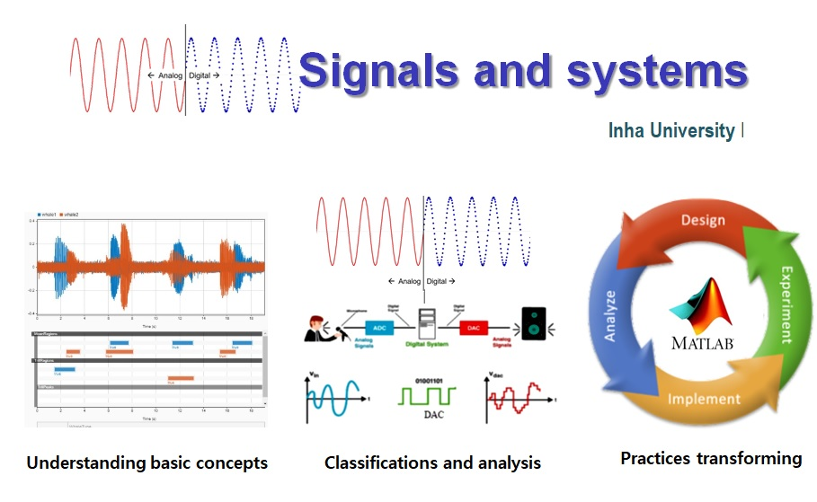

  
  <h2>Signal and System Design[202301-IGS2137-001]</h2>
  

    <b>Feruz Ubaydullaev</b>
    ·
    <b>12204578</b>
  

  

    
Table of Contents

    <ul>
      <li><a href="#week-2">Week 2</a></li>
      <li><a href="#week-3">Week 3</a></li>
      <li><a href="#week-4">Week 4</a></li>
      <li><a href="#week-6">Week 6</a></li>
      <li><a href="#week-7">Week 7</a></li>
    </ul>
  

 

## Week 2
![Exercise 2.1][2_1]

><a href="week 2/week2_1.m"> Solution <a/>

![Exercise 2.2][2_2]

><a href="week%202/week2_2.m"> Solution <a/>

## Week 3
![Exercise 3.1][3_1]
![Exercise 3.2][3_2]

## Week 4
![Exercise 4.1][4_1]
![Exercise 4.2][4_2]
![Exercise 4.3][4_3]
![Exercise 4.4][4_4]
![Exercise 4.5][4_5]
![Exercise 4.6][4_6]

## Week 6
![Exercise 6.1][6_1]
![Exercise 6.2][6_2]
![Exercise 6.3][6_3]
![Exercise 6.4][6_4]
![Exercise 6.5][6_5]

## Week 7
![Exercise 7.1][7_1]
![Exercise 7.1][7_2]

[2_1]: img/2_1.png
[2_2]: img/2_2.png
[3_1]: img/3_1.png
[3_2]: img/3_2.png
[4_1]: img/4_1.png
[4_2]: img/4_2.png
[4_3]: img/4_3.png
[4_4]: img/4_4.png
[4_5]: img/4_5.png
[4_6]: img/4_6.png
[6_1]: img/6_1.png
[6_2]: img/6_2.png
[6_3]: img/6_3.png
[6_4]: img/6_4.png
[6_5]: img/6_5.png
[7_1]: img/7_1.png
[7_1]: img/7_1.png
